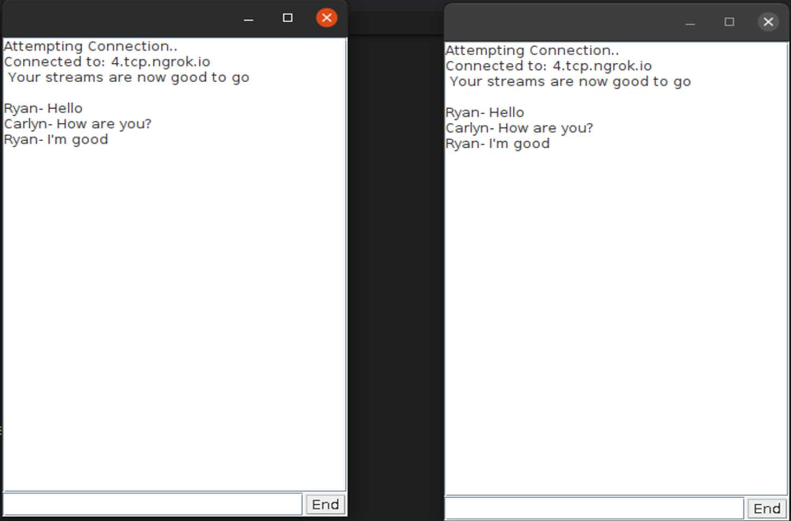

# Multithreaded chat systm

## Description
A simple Java swing based multiple threaded chat system. Requires the clients to be inside same network but can work for remote networks as well using IP forwarding tools such as Ngrok.

## How to run the code?
1. Run the **Server.java** file
2. Run **client.java** for each client who wants to join the chat room

## Output

